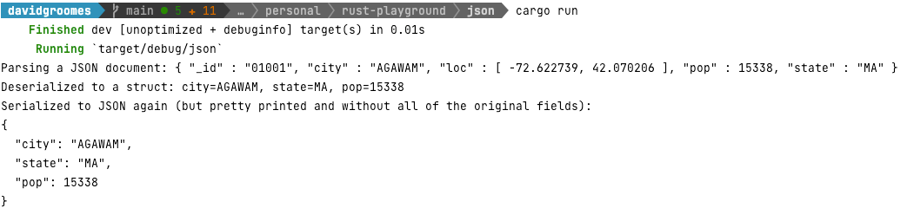

# json

A simple Rust program to deserialize and serialize JSON using the popular Rust JSON library called [*Serde*](https://github.com/serde-rs/json).

## Instructions

1. Build and run:
   * `cargo run`
   * It will output:
    

## Reference

* [*Serde*](https://github.com/serde-rs/json)
    * <https://github.com/serde-rs/json>
    * I believe this is the de-facto JSON serialization/deserialization library used in the Rust community.
